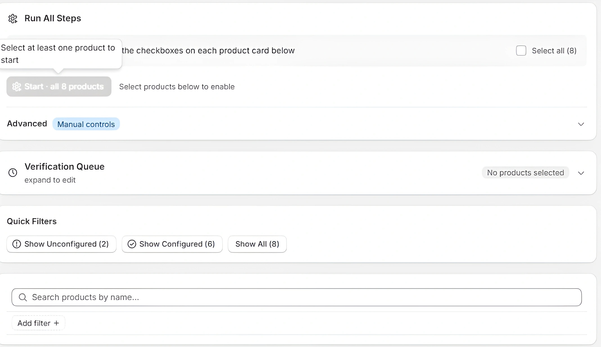
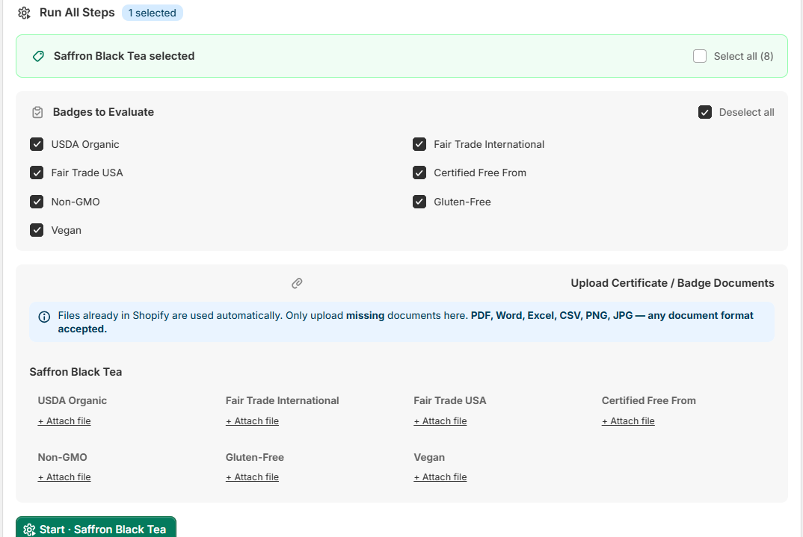
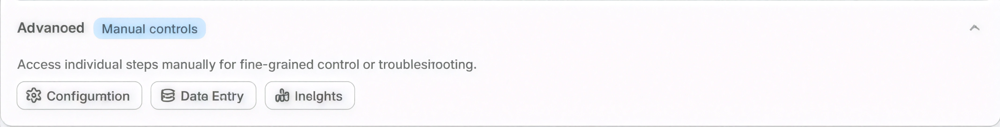
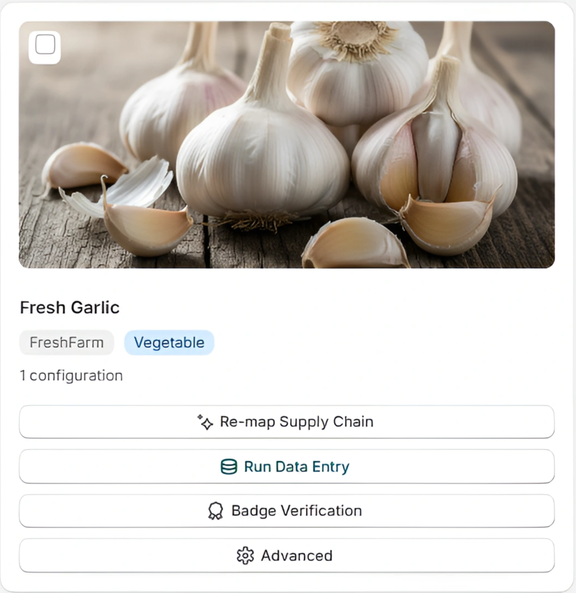
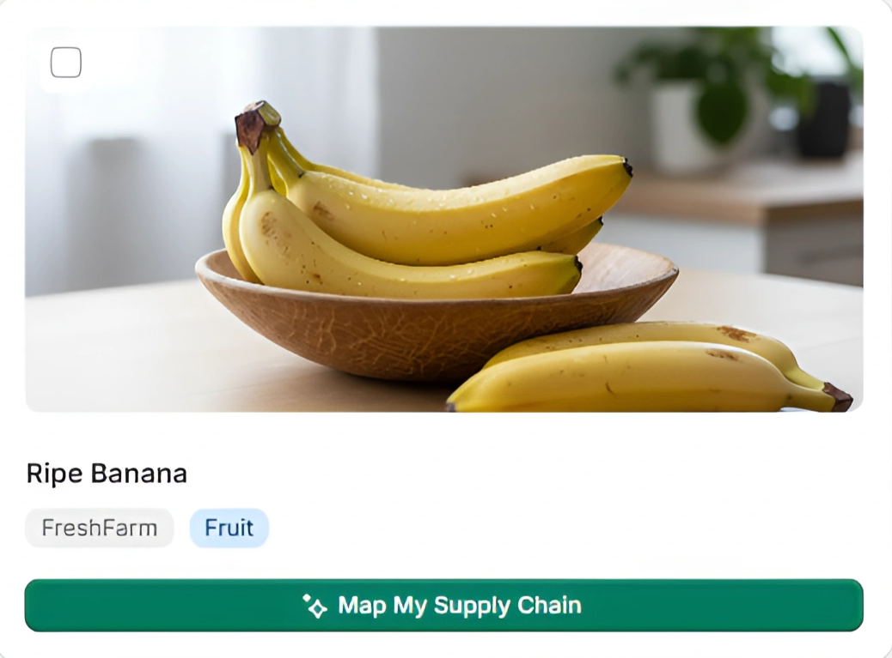

import PageFeedback from '@site/src/components/PageFeedback';

# Advanced

The **Advanced** page (also called **TilliT Insights**) is your main control center. From here you can run TilliT's AI pipeline on your products, manage which products get automatically verified on a schedule, and filter or search your catalog.

**How to get here:** `Shopify Admin` → `Apps` → `TILLIT AI Staging` → `Advanced`

---

## Page overview

The page has four main sections from top to bottom:

1. **Run All Steps** — run the full AI pipeline on selected products
2. **Verification Queue** — choose which products auto-verify on a schedule
3. **Quick Filters** — filter your product list
4. **Product Cards** — your full product catalog with per-product actions

---

## 1. Run All Steps

This section lets you trigger TilliT's full AI pipeline on one or more products.

### How to run

1. Scroll down to the product cards
2. Tick the checkbox on each product you want to process
3. Scroll back to the top — the panel updates to show your selection
4. Choose which **Badges to Evaluate** — all 7 are selected by default, uncheck the ones you don't need:
   - USDA Organic
   - Fair Trade International
   - Fair Trade USA
   - Certified Free From
   - Non-GMO
   - Gluten-Free
   - Vegan

5. Under **Upload Certificate / Badge Documents**, click **+ Attach file** next to each badge you need to provide a certificate for

:::info
Files already uploaded in your Shopify store are used automatically. You only need to attach a file here if a certificate is missing from Shopify.

Accepted formats: PDF, Word, Excel, CSV, PNG, JPG — any document format is accepted.
:::

6. Click the green **Start · [Product Name]** button

### Progress panel

Once you click Start, a progress panel appears showing 4 steps running in sequence:

| Step | What it does |
|---|---|
| **Select Products** | Confirms which products are queued |
| **Map My Supply Chains** | AI generates supply chain configurations for your products |
| **Fill Data for My Products** | Fills in supply chain data |
| **Evaluate My Badges** | Verifies badge claims against your certificates |

Each step shows one of these statuses:

| Status | Meaning |
|---|---|
| **Running** | Currently in progress |
| **Done** | Completed successfully |
| **Pending** | Waiting for a previous step to finish |
| **Skipped** | Step was skipped (see note below) |

:::info
**"Evaluate My Badges" shows Skipped?** This is normal — it means no certificate files were attached, so there was nothing to verify. It is not an error. To run badge evaluation, attach certificate files in step 5 above.
:::

When all steps are complete, the panel shows **"All steps complete"** with the total time taken.

---

### Advanced — Manual controls

Click **Advanced / Manual controls** to expand a sub-section that lets you run each pipeline step individually. Use this when you need to re-run a specific step or troubleshoot.

| Button | What it runs |
|---|---|
| **Configuration** | Re-runs the supply chain configuration step only |
| **Data Entry** | Re-runs the data entry step only |
| **Insights** | Re-runs the insights and analytics step only |

---

## 2. Verification Queue

The Verification Queue lets you schedule which products TilliT automatically re-verifies on each backend run — without you needing to trigger it manually each time.

### How to set it up

1. Click on **Verification Queue** to expand it
2. Tick the checkbox next to each product you want included in automatic runs
3. Use **Select all (8)** to add all products at once
4. Click **Save Queue**

:::tip
Products in the Verification Queue are verified automatically on TilliT's scheduled runs. You don't need to come back and run them manually each time.
:::

:::info
If no products are ticked, the Save Queue button shows: *"No products queued — select products above and save."*
:::

---

## 3. Quick Filters

Use these filters to narrow down what appears in the product grid below.

| Filter | Shows |
|---|---|
| **Show Unconfigured (2)** | Products not yet set up with TilliT |
| **Show Configured (6)** | Products already configured and active |
| **Show All (8)** | All products in your catalog |

You can also **search by product name** or click **Add filter +** to apply additional filters.

---

## 4. Product Cards

Your products are displayed as cards in a two-column grid. What you see on each card depends on whether the product is configured or not.

### Configured products

Products that have been set up with TilliT show four action buttons:

| Button | What it does |
|---|---|
| **Re-map Supply Chain** | Re-runs supply chain mapping for this product |
| **Run Data Entry** | Re-runs the data entry step for this product |
| **Badge Verification** | Opens the badge verification flow for this product |
| **Advanced** | Opens advanced settings for this specific product |

:::info
**Run Data Entry** includes auto-fill options — **Auto-Fill Configuration** and **Auto-Fill All** — which automatically populate traceability data fields using your Shopify product data.
:::

:::info
**Badge Verification** opens a step-by-step flow: select which badge to verify → select a region → click **Create Case**. The system then processes the verification and returns a result (Verified, Pending, or Failed).
:::

Below the product name you will also see:
- **Shop name** — the Shopify store this product belongs to (e.g. *"tillit-test-shop3"*), shown in small grey text
- **Category tags** — colored pill badges showing the product's categories (e.g. FreshFarm, Vegetable, Fruit)
- **Configuration count** — e.g. *"2 configurations"* showing how many supply chain configurations exist for this product

### Unconfigured products

Products not yet set up show a single green button:

**→ Map My Supply Chain** — click this to start the TilliT setup process for that product.

:::tip
Use **Show Unconfigured** in Quick Filters to quickly find products that still need to be set up.
:::

<PageFeedback />
