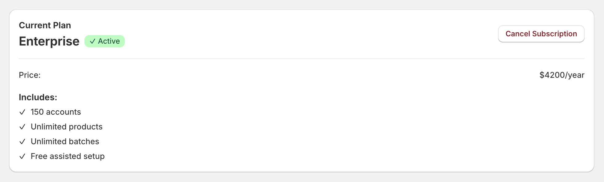
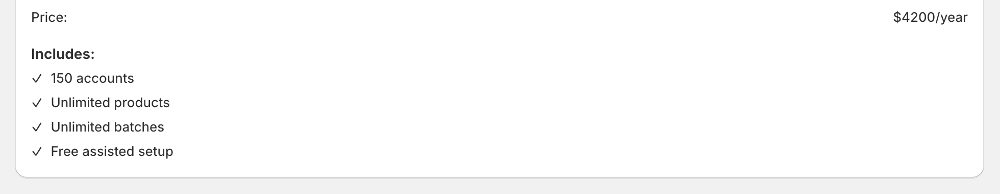
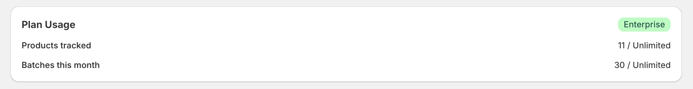
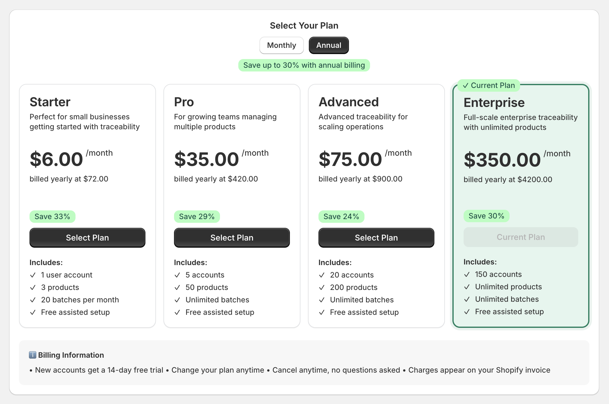
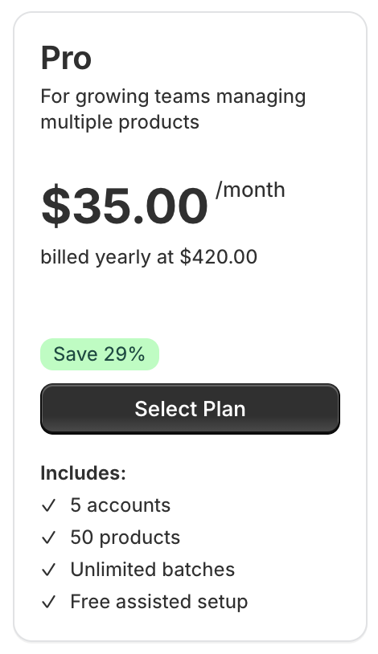
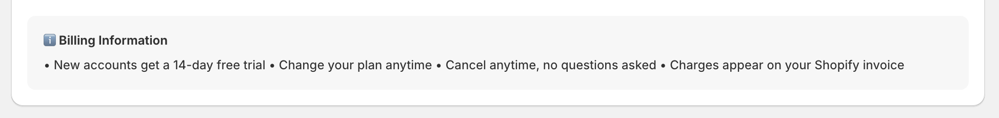
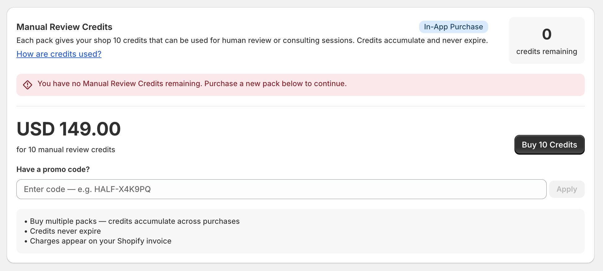
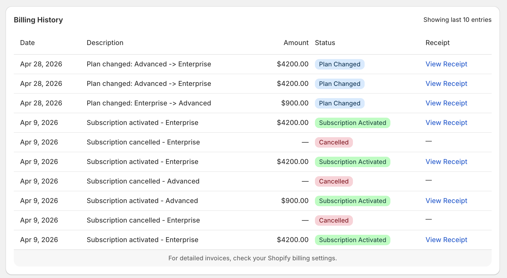

# Subscription & Billing Management

This page allows users to manage their subscription plan, monitor usage, purchase credits, and review billing history. It provides full control over pricing, scaling, and financial tracking.

---

## Current Plan Overview

Displays the active subscription plan and its status.

**Key Details:**

- **Plan Name:** Enterprise
- **Status:** Active
- **Billing:** $4200/year

This section provides a quick summary of the store’s current subscription and billing status.

---

## Plan Features

Shows the features included in the current plan.

**Enterprise Plan Includes:**

- 150 user accounts
- Unlimited products
- Unlimited batches
- Free assisted setup

Higher-tier plans offer greater scalability for large operations.

---

## Plan Usage

Tracks real-time usage of system resources.

**Metrics:**

- **Products tracked:** 11 / Unlimited
- **Batches this month:** 30 / Unlimited

This helps users monitor their usage against plan limits.

---

## Plan Selection

Users can view and switch between available subscription plans.

### Starter

- 1 user account
- 3 products
- 20 batches per month
- Free assisted setup

### Pro

- 5 user accounts
- 50 products
- Unlimited batches
- Free assisted setup

### Advanced

- 20 user accounts
- 200 products
- Unlimited batches
- Free assisted setup

### Enterprise (Current Plan)

- 150 user accounts
- Unlimited products
- Unlimited batches
- Free assisted setup

All plans are billed annually with discounted pricing.

---

## Pricing Model

Each plan includes:

- Monthly equivalent pricing
- Annual billing total
- Discount percentage

Annual billing offers up to **30% savings** compared to monthly pricing.

---

## Billing Information

- New accounts receive a **14-day free trial**
- Plans can be changed at any time
- Subscriptions can be cancelled anytime
- Charges are applied via Shopify billing

This ensures flexibility and transparency for users.

---

## Manual Review Credits

Manual Review Credits allow access to human verification and consulting services.

**Details:**

- 1 pack = 10 credits
- Price: $149 per pack
- Credits never expire
- Credits accumulate across purchases

Credits can be used for:

- Manual badge verification
- Expert consultation

This supports hybrid verification beyond automated systems.

---

## Credit Usage

Displays the number of available credits.

**Example:**

- 0 credits remaining

Users must purchase additional credits to continue using manual review services.

---

## Promo Codes

Users can apply promotional codes when purchasing credits.

This allows discounts on credit purchases.

---

## Billing History

Shows recent subscription and billing activity.

**Table Columns:**

- Date
- Description
- Amount
- Status
- Receipt

This provides a complete record of financial transactions.

---

## Billing Status Types

- **Success:** Completed transactions
- **Info:** Plan updates or changes
- **Critical:** Cancellations or failed actions

These statuses help users understand billing events at a glance.

---

## Plan Change History

Tracks transitions between subscription plans.

**Examples:**

- Advanced → Enterprise
- Enterprise → Advanced

This provides a clear audit trail of subscription changes.

---

## Shopify Billing Integration

All payments and invoices are handled through Shopify.

Users can view detailed invoices directly in their Shopify billing settings.

---
