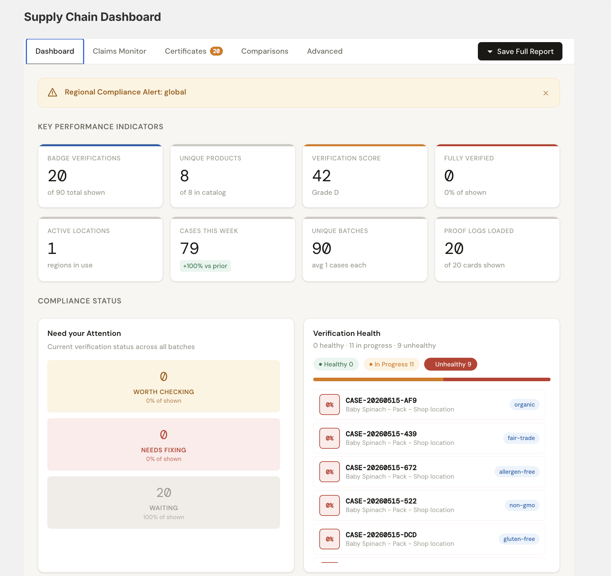
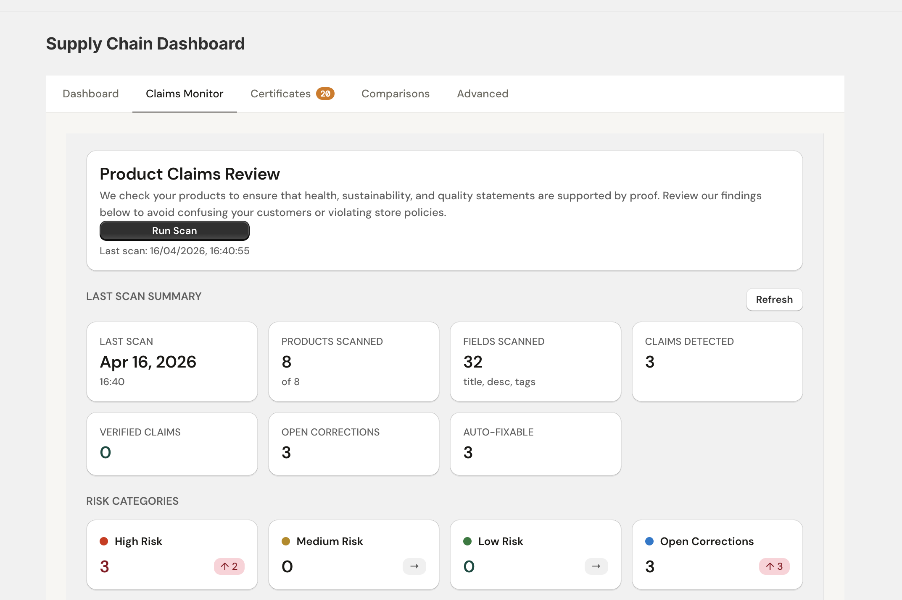
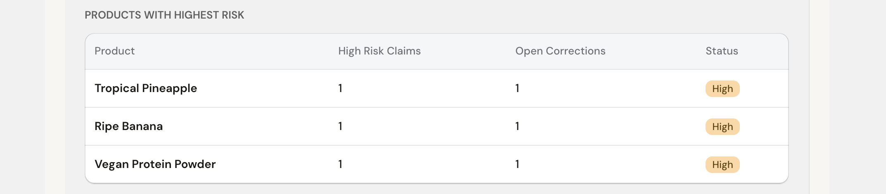
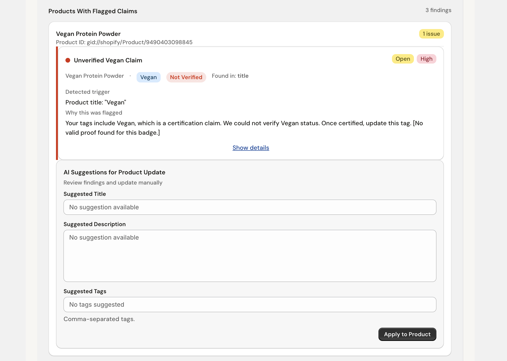
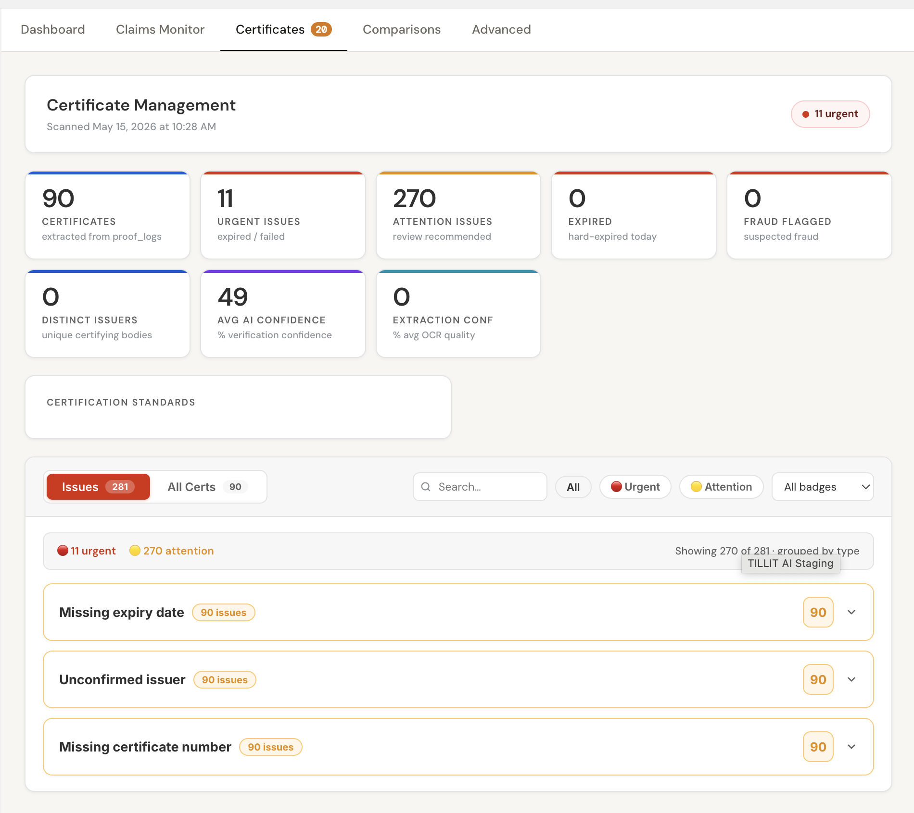
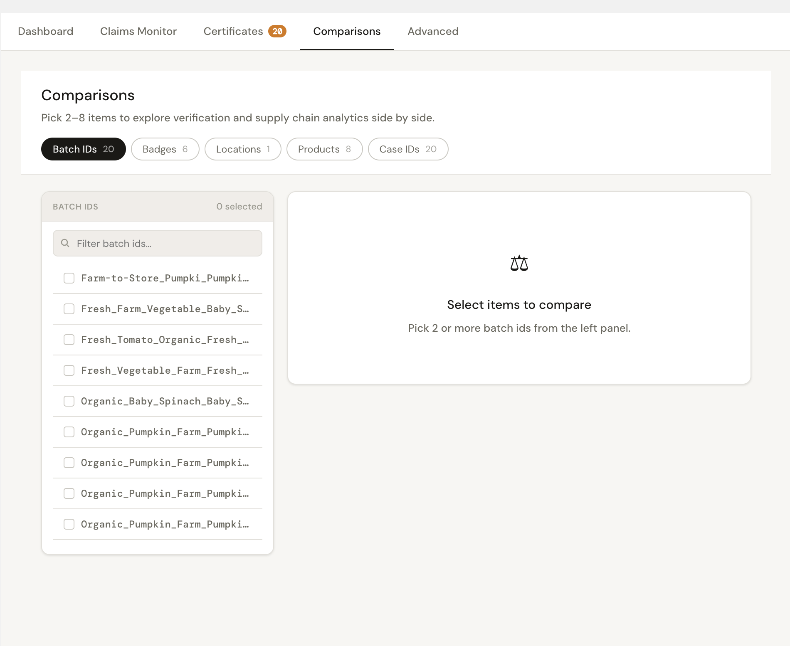
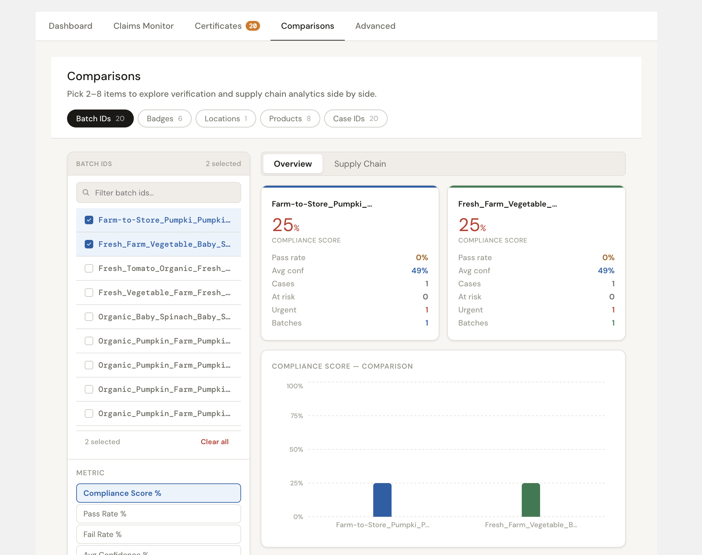
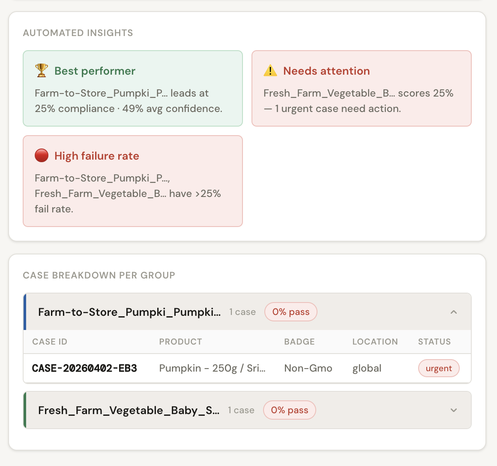

import PageFeedback from '@site/src/components/PageFeedback';

# Dashboard

The **Dashboard** (also called the **Supply Chain Dashboard**) gives you a real-time overview of your badge verification activity, compliance health, and supply chain performance across all your products.

**How to get here:** `Shopify Admin` → `Apps` → `TILLIT AI Staging` → `Dashboard`

---

## Page overview



The Dashboard has five tabs along the top:

| Tab                | What it shows                                            |
| ------------------ | -------------------------------------------------------- |
| **Dashboard**      | KPI summary cards and anomaly alerts                     |
| **Comparisons**    | Side-by-side product or badge comparisons                |
| **Claims Monitor** | Live status of all active badge claims                   |
| **Certificates**   | Uploaded certificate files and their verification status |
| **Advanced**       | Advanced analytics and raw data                          |

There is also a **Save PDF** button at the top right to export the current view.

---

## KPI Cards

The Dashboard tab displays eight metric cards at a glance:

| Metric                  | What it means                                      |
| ----------------------- | -------------------------------------------------- |
| **Badge Verifications** | Total number of badge verifications run            |
| **Unique Products**     | Number of distinct products tracked                |
| **Verification Score**  | Overall compliance grade (0–100 / Grade A–F)       |
| **Fully Verified**      | Products with all badges successfully verified     |
| **Active Locations**    | Number of supply chain locations currently active  |
| **Cases This Week**     | Verification cases opened in the current week      |
| **Unique Batches**      | Number of distinct product batches tracked         |
| **Proof Logs Loaded**   | Number of proof log entries loaded into the system |

---

## Anomaly Alerts

When compliance issues are detected, a red alert banner appears at the top of the dashboard. Example:

> **Regional compliance below 50% — action required.**

These alerts flag situations that need your attention — such as low verification scores or missing certificates in a region.

---

# Tabs

# Claims Monitor

# Product Claims Review

The Product Claims Review module validates product-related claims against available certification proof. The system identifies unsupported claims, categorizes risk levels, and provides merchant correction workflows to maintain compliance and customer trust.

---

## Claims Monitor Dashboard

The Claims Monitor dashboard provides centralized visibility into product claim verification activity across the storefront.

### Core Functions

- Automated product claim scanning
- Unsupported claim detection
- Compliance monitoring
- Risk categorization
- AI-assisted correction workflow



---

## Product Claims Review Overview

The Product Claims Review section initiates compliance scans and displays scan activity details.

### Features

- Run manual compliance scans
- Review latest scan timestamp
- Detect unsupported certification-related claims
- Analyze:
  - Product titles
  - Product descriptions
  - Product tags

### Scan Information

| Field            | Description                         |
| ---------------- | ----------------------------------- |
| Last Scan        | Timestamp of latest completed scan  |
| Products Scanned | Number of products analyzed         |
| Fields Scanned   | Product fields reviewed             |
| Claims Detected  | Total unsupported claims identified |



---

## Last Scan Summary

The Last Scan Summary section provides a high-level overview of compliance results from the latest scan execution.

### Summary Metrics

| Metric           | Value |
| ---------------- | ----- |
| Products Scanned | 8     |
| Fields Scanned   | 32    |
| Claims Detected  | 3     |
| Verified Claims  | 0     |
| Open Corrections | 3     |
| Auto-Fixable     | 3     |

### Risk Categories

The platform classifies issues into risk levels for prioritization.

| Risk Category    | Description                                    |
| ---------------- | ---------------------------------------------- |
| High Risk        | Unsupported or misleading certification claims |
| Medium Risk      | Moderate compliance concerns                   |
| Low Risk         | Minor informational inconsistencies            |
| Open Corrections | Issues pending merchant review                 |

---

## Products With Highest Risk

The Highest Risk Products table identifies products containing unresolved compliance issues.

### Table Columns

| Column           | Description                         |
| ---------------- | ----------------------------------- |
| Product          | Product name                        |
| High Risk Claims | Number of detected high-risk claims |
| Open Corrections | Pending unresolved issues           |
| Status           | Current compliance severity         |

### High Risk Products

- Tropical Pineapple
- Ripe Banana
- Vegan Protein Powder



---

## Products With Flagged Claims

The Products With Flagged Claims section displays detailed issue-level findings for products containing unsupported claims.

### Included Information

- Product identifier
- Detected certification claim
- Verification status
- Trigger source
- Risk level
- Merchant correction workflow

---

## Unverified Claim Detection

The platform automatically detects certification-related keywords that cannot be validated against stored proof records.

### Example Detection

| Field   | Value                |
| ------- | -------------------- |
| Product | Vegan Protein Powder |
| Claim   | Vegan                |
| Status  | Not Verified         |
| Source  | Product Title        |

### Trigger Detection

```text
Product title: "Vegan"
```

# Certificates

# Certificate Management

The Certificate Management module provides centralized monitoring and operational management for extracted certification records, verification quality, and certificate-related compliance issues.

This dashboard enables administrators to review certificate extraction results, monitor AI confidence scores, identify verification risks, and manage unresolved certification issues.

---

## Certificate Management Overview

The Certificate Management dashboard displays certificate scanning activity and aggregated verification statistics.

### Core Functions

- Monitor extracted certificates
- Detect expired or invalid certifications
- Review verification confidence scores
- Track unresolved certificate issues
- Manage operational review workflows

### Scan Information

| Field          | Description                                             |
| -------------- | ------------------------------------------------------- |
| Scan Timestamp | Latest certificate extraction scan                      |
| Urgent Cases   | Critical verification issues requiring immediate review |



---

## Certificate Statistics Dashboard

The statistics dashboard provides a high-level overview of certificate extraction and verification performance.

### Dashboard Metrics

| Metric                | Description                               |
| --------------------- | ----------------------------------------- |
| Certificates          | Total extracted certification records     |
| Urgent Issues         | Expired or failed certificate validations |
| Attention Issues      | Cases requiring operational review        |
| Expired               | Hard-expired certificates                 |
| Fraud Flagged         | Suspected fraudulent certifications       |
| Distinct Issuers      | Unique certification authorities          |
| Avg AI Confidence     | Average AI verification confidence        |
| Extraction Confidence | Average OCR extraction quality            |

---

## Extracted Certificates

The Certificates metric displays the total number of certification records extracted from uploaded proof logs.

### Example

```text
90 Certificates extracted from proof_logs
```

# Comparisons

# Comparisons Dashboard

The Comparisons Dashboard enables side-by-side analysis of verification performance, compliance metrics, and supply chain analytics across multiple batches, products, badges, and case groups.

The module supports comparative monitoring to identify high-risk supply chain groups, low-performing batches, and urgent compliance cases.

---

## Comparisons Overview

The Comparisons page allows merchants to select and compare multiple entities simultaneously.

### Supported Comparison Types

- Batch IDs
- Badges
- Locations
- Products
- Case IDs

### Features

- Multi-item comparison
- Compliance score visualization
- Supply chain analytics
- Risk identification
- Case-level monitoring



---

## Batch Selection Panel

The Batch Selection Panel allows users to filter and select supply chain batches for comparative analysis.

### Functions

- Search batch identifiers
- Select multiple batches
- Clear selected items
- Review selected comparison count

### Selected Batch Examples

- Farm-to-Store_Pumpki_Pumpki...
- Fresh_Farm_Vegetable_Baby_S...

The platform supports comparison between multiple supply chain groups simultaneously.

---

## Comparison Metrics

The Metrics section controls which performance indicator is visualized in the comparison chart.

### Available Metrics

| Metric             | Description                                  |
| ------------------ | -------------------------------------------- |
| Compliance Score % | Overall verification compliance level        |
| Pass Rate %        | Percentage of successful verification checks |
| Fail Rate %        | Percentage of failed verification checks     |
| Avg Confidence %   | Average verification confidence score        |

The selected metric dynamically updates the comparison visualization.

---

## Compliance Score Overview

The Overview panel displays high-level compliance statistics for each selected batch group.

### Included Statistics

| Metric           | Description                      |
| ---------------- | -------------------------------- |
| Compliance Score | Overall compliance percentage    |
| Pass Rate        | Percentage of successful cases   |
| Avg Confidence   | Average AI confidence score      |
| Cases            | Total tracked verification cases |
| At Risk          | Number of risky cases            |
| Urgent           | High-priority unresolved issues  |
| Batches          | Number of related batches        |

### Example Results

| Group                    | Compliance Score |
| ------------------------ | ---------------- |
| Farm-to-Store*Pumpki*... | 25%              |
| Fresh*Farm_Vegetable*... | 25%              |



---

## Comparison Visualization

The Compliance Score Comparison chart visualizes verification performance across selected groups.

### Visualization Features

- Comparative bar chart analysis
- Multi-group performance tracking
- Metric-based visualization updates
- Compliance trend monitoring

The graph updates dynamically based on the selected metric and batch groups.

---

## Supply Chain Comparison

The Supply Chain tab enables comparative analysis of supply chain verification performance across locations and product flows.

### Supported Analysis

- Batch-level verification tracking
- Cross-location compliance comparison
- Product sourcing analysis
- Certification verification trends

This view provides operational visibility into supply chain performance and compliance consistency.

---

# Automated Insights

The Automated Insights module highlights important verification trends and risk patterns identified by the analytics engine.

### Insight Categories

| Category          | Description                                |
| ----------------- | ------------------------------------------ |
| Best Performer    | Highest-performing compliance group        |
| Needs Attention   | Groups requiring immediate review          |
| High Failure Rate | Groups with elevated verification failures |



---

## Best Performer Detection

The system automatically identifies the strongest-performing supply chain group based on compliance metrics and verification confidence.

### Example Insight

```text
Farm-to-Store_Pumpki_P... leads at
25% compliance · 49% avg confidence.
```

This helps merchants identify reliable supply chain segments and successful verification flows.

---

## Needs Attention Detection

The analytics engine flags groups with unresolved or urgent compliance concerns.

### Example Insight

```text
Fresh_Farm_Vegetable_B... scores 25%
— 1 urgent case needs action.
```

Groups marked as requiring attention should be reviewed to prevent unresolved verification issues.

---

## High Failure Rate Monitoring

The High Failure Rate insight identifies supply chain groups exceeding acceptable verification failure thresholds.

### Example Insight

```text
Farm-to-Store_Pumpki_P...,
Fresh_Farm_Vegetable_B...
have >25% fail rate.
```

This functionality supports proactive compliance management and issue resolution.

---

## Case Breakdown Per Group

The Case Breakdown section displays detailed verification cases grouped by supply chain or batch identifier.

### Displayed Information

| Field    | Description                         |
| -------- | ----------------------------------- |
| Case ID  | Unique verification case identifier |
| Product  | Related product batch               |
| Badge    | Certification type                  |
| Location | Verification region                 |
| Status   | Current case severity               |

### Example Case

| Field    | Value                   |
| -------- | ----------------------- |
| Case ID  | CASE-20260402-EB3       |
| Product  | Pumpkin – 250g / Sri... |
| Badge    | Non-GMO                 |
| Location | Global                  |
| Status   | Urgent                  |

---

## Verification Status Indicators

The system uses status indicators to classify case urgency and verification outcomes.

| Status  | Description                         |
| ------- | ----------------------------------- |
| Pass    | Verification completed successfully |
| At Risk | Potential compliance concern        |
| Urgent  | Immediate action required           |

These indicators help merchants prioritize operational responses and compliance reviews.

---

## Comparative Analytics Workflow

The comparison workflow follows the process below:

1. Select comparison category
2. Choose multiple batches or groups
3. Select a comparison metric
4. Review comparative analytics
5. Analyze automated insights
6. Investigate urgent verification cases

This workflow supports data-driven compliance analysis and supply chain verification monitoring.

---

<PageFeedback />
