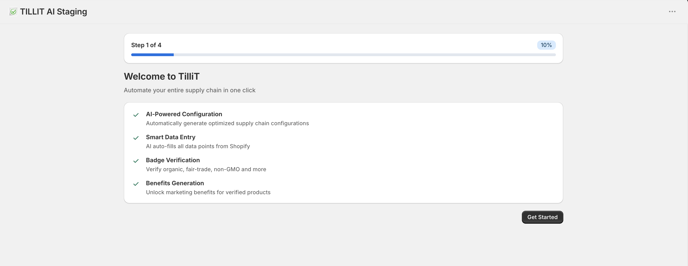
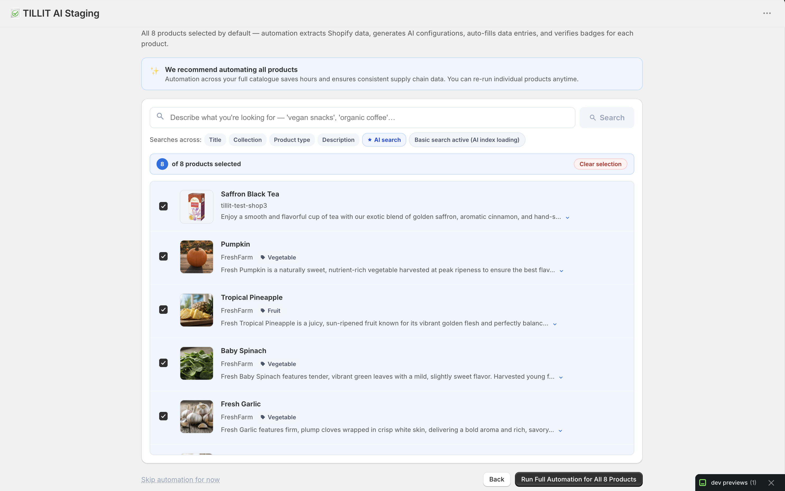
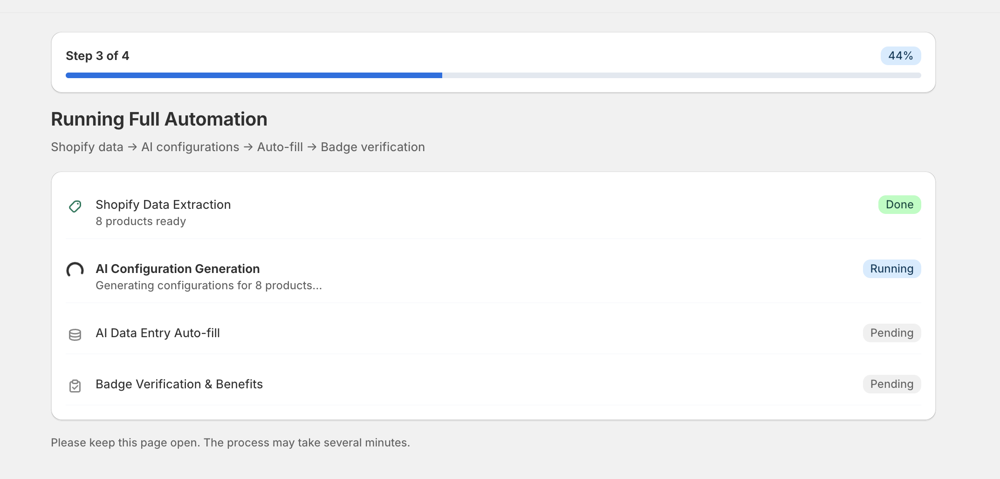

# AI-Powered Setup & Automation Wizard

The Setup Wizard helps users automatically configure their supply chain system using AI-powered automation. The onboarding process simplifies product setup, supply chain configuration, data entry, and certification verification.

---

# Step 1 — Welcome to TilliT

The onboarding process begins with an introduction to the platform’s automation capabilities.

## Features Introduced

### AI-Powered Configuration

Automatically generates optimized supply chain configurations for products.

### Smart Data Entry

Extracts and auto-fills supply chain data directly from Shopify.

### Badge Verification

Verifies certifications such as:

- Organic
- Fair-Trade
- Non-GMO
- Other compliance badges

### Benefits Generation

Generates AI-powered marketing benefits for verified products.

# Step 2 — Product Selection

Users can select which Shopify products should be included in the automation process.

All products are selected by default to maximize automation coverage and reduce setup time.

---

## Automation Includes

The automation process performs:

- Shopify data extraction
- AI configuration generation
- Automatic data entry
- Badge verification
- Benefits generation

# Product Search & Filtering

The setup wizard supports intelligent product searching and filtering.

## Search Sources

The search feature can search using:

- Product title
- Collection
- Product type
- Product description

## Search Modes

### AI Search

Uses AI-powered indexing for advanced matching.

### Basic Search

Uses standard keyword matching.

# Product Selection Overview

The system displays the number of selected products before automation begins.

# Product Cards

Each product card displays:

- Product image
- Product name
- Vendor
- Product category
- Product description preview

This helps users verify products before running automation.

# Step 3 — Running Full Automation

The platform performs automated setup operations for selected products.

---

## Automation Workflow

The automation pipeline includes:

1. Shopify Data Extraction
2. AI Configuration Generation
3. AI Data Entry Auto-fill
4. Badge Verification & Benefits Generation

# Automation Pipeline Status

Each automation stage displays a real-time status indicator.

## Status Types

### Done

The step completed successfully.

### Running

The step is currently processing.

### Pending

The step has not started yet.

This provides visibility into the automation lifecycle.

# Shopify Data Extraction

The system extracts product information directly from Shopify before automation begins.

## Extracted Information

- Product names
- Categories
- Product descriptions
- Product metadata

# AI Configuration Generation

AI automatically creates optimized supply chain configurations for products.

This minimizes manual setup work and improves consistency across the catalog.

# AI Data Entry Auto-fill

The platform automatically fills supply chain data fields using extracted Shopify information.

This significantly reduces repetitive manual data entry tasks.

# Badge Verification & Benefits Generation

The system verifies certifications and generates customer-facing benefit content.

## Supported Verification Types

- Organic certifications
- Fair-trade verifications
- Non-GMO badges
- Additional compliance certifications

# Step 4 — Automation Complete

The final step confirms that the automation process completed successfully.

The supply chain system is now fully configured and ready for use.

# Automation Summary

The completion screen displays a summary of completed onboarding tasks.

## Summary Includes

- Wizard initialized
- Products configured
- Full automation completed

# Next Steps

After setup is completed, users can navigate to key platform modules.

## Available Sections

### Configuration

Manage and edit supply chain configurations.

### Data Entry

Collect and manage supply chain information.

### Insights

View analytics, reporting, and operational insights.
