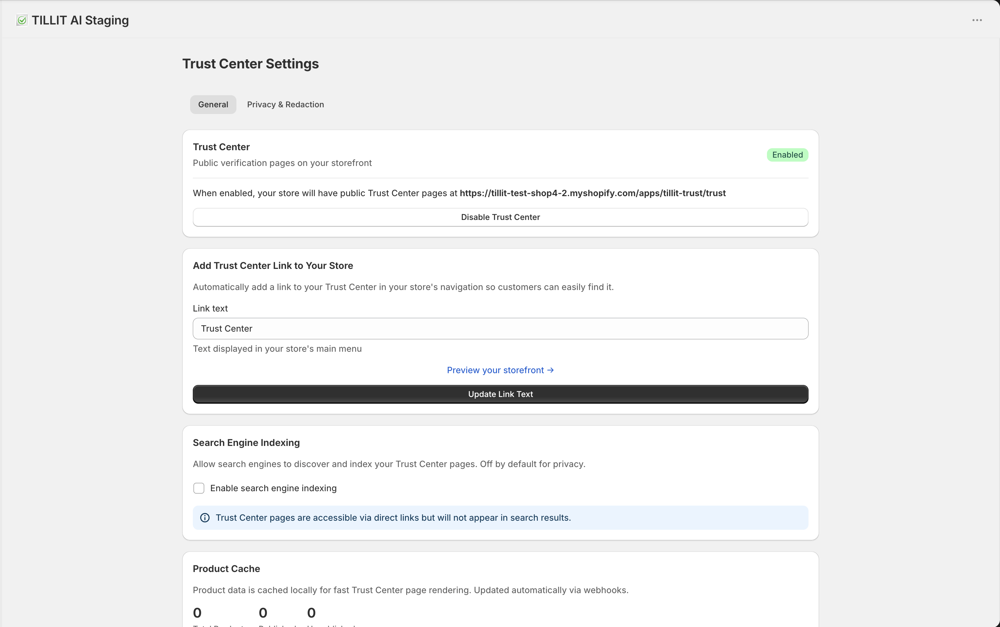
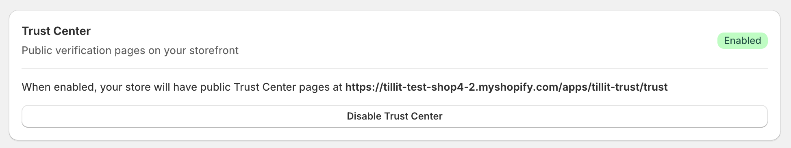
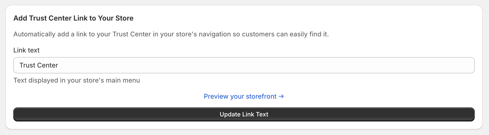
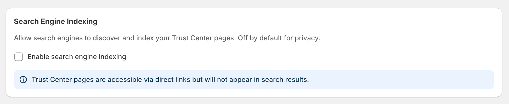
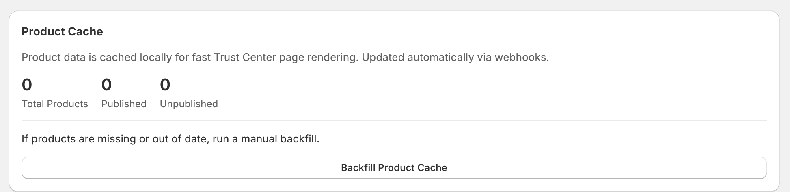
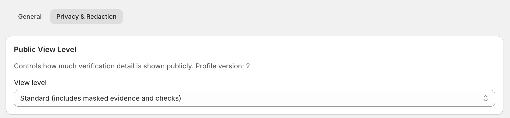
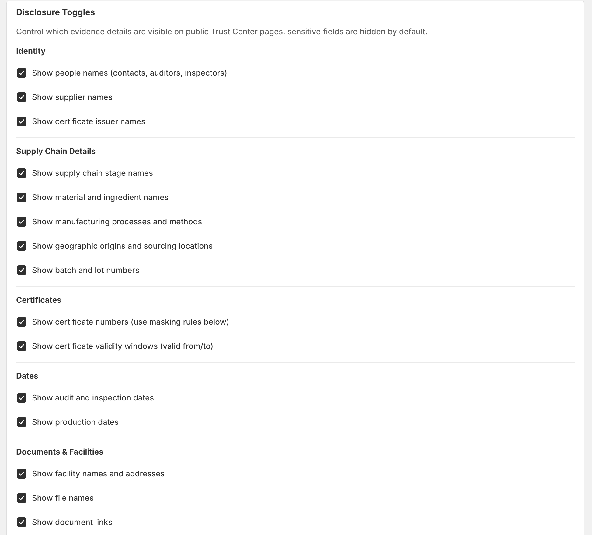
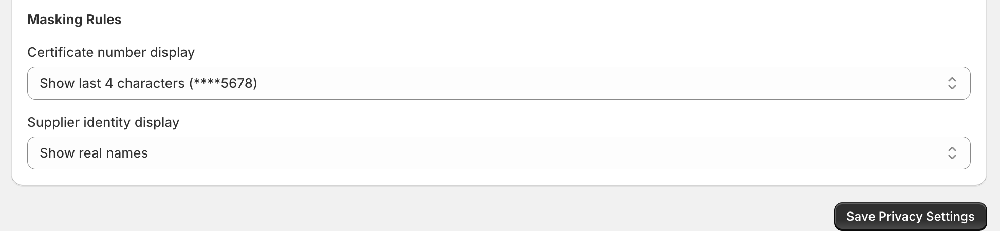

# Trust Center & Privacy Management

This page allows store owners to configure the **Trust Center**, a public-facing verification hub that displays product certifications, supply chain transparency, and supporting evidence.

---

# General

## 1. Trust Center Overview

The Trust Center enables public verification pages for your store.

- Status: **Enabled**
- Generates a public Trust Center page
- Displays verified product certifications

> When enabled, customers can access a centralized transparency page for your store.

---

## 2. Public Access

The Trust Center is accessible via a public URL.

- Can be shared directly with customers
- Acts as a verification hub for certifications

---

## 3. Navigation Integration

You can add the Trust Center link to your store navigation.

- Customizable link text (e.g., _Trust Center_)
- Appears in the main menu

> Improves accessibility and visibility for customers.

---

## 4. Search Engine Indexing

Controls whether Trust Center pages appear in search engines.

- **Disabled (default):**

  - Accessible via direct link only
  - Not indexed by search engines

- **Enabled:**
  - Pages can appear in search results

> Useful for balancing visibility and privacy.

---

## 5. Product Cache

Product data is cached locally for performance.

- Automatically updated via webhooks
- Manual backfill available if data is missing

### Metrics:

- Total Products
- Published
- Unpublished

> Ensures fast loading and consistent data display.

---

# Privacy & Redaction

## 6. Public View Level

Defines how much verification data is shown publicly.

### Current Mode:

- **Standard**
  - Includes masked evidence
  - Includes verification checks

> Provides transparency while protecting sensitive data.

---

## 7. Disclosure Controls

Fine-grained control over what data is visible on the Trust Center.

---

### 7.1 Identity

Controls visibility of identity-related data:

- People names (auditors, inspectors)
- Supplier names
- Certificate issuers

---

### 7.2 Supply Chain Details

Controls visibility of supply chain data:

- Stage names
- Materials and ingredients
- Manufacturing processes
- Geographic origins
- Batch and lot numbers

> Enables full supply chain transparency.

---

### 7.3 Certificates

Controls certification details:

- Certificate numbers
- Validity periods (valid from/to)

---

### 7.4 Dates

Controls timeline-related information:

- Audit dates
- Inspection dates
- Production dates

---

### 7.5 Documents & Facilities

Controls access to supporting documents:

- Facility names and addresses
- File names
- Document links

---

## 8. Masking Rules

Defines how sensitive information is partially hidden.

### Examples:

- **Certificate Numbers:**

  - Display format: `****5678` (last 4 characters only)

- **Supplier Identity:**
  - Option to show real names or keep hidden

> Protects sensitive data while maintaining trust.

---

:::info
**Notes**

- Trust Center pages are public-facing
- Data visibility is fully configurable
- Changes apply instantly to public pages
  :::
