import PageFeedback from '@site/src/components/PageFeedback';

# Widget Management

**Widget Management** controls which verified certification badges appear on your Shopify storefront and how customers interact with them.

Navigate to **Widgets** in the left sidebar of the TilliT AI app.

---

## Overview

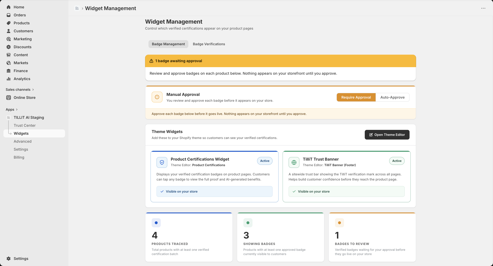

The **Widget Management** dashboard gives you full control over:

- Badge approvals
- Storefront visibility
- Product-level certification tracking

The Widgets page has two tabs:

| Tab                     | What it does                                                                 |
| ----------------------- | ---------------------------------------------------------------------------- |
| **Badge Management**    | Approve badges, configure theme widgets, manage per-product badge visibility |
| **Badge Verifications** | View detailed verification records for each badge                            |

---

## Badge Management

### Approval Mode

Before any badge appears on your storefront, you must approve it. You control how this works:

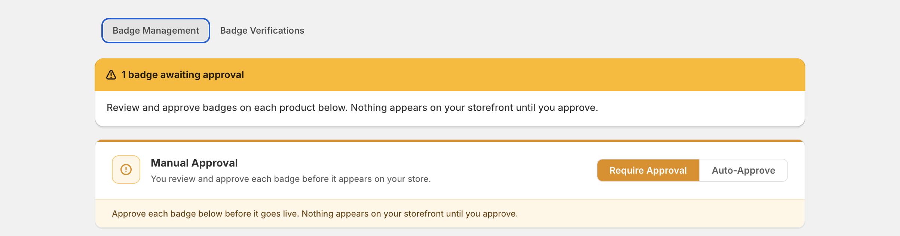

| Mode                 | Description                                                              |
| -------------------- | ------------------------------------------------------------------------ |
| **Require Approval** | You manually review and approve each badge before it goes live           |
| **Auto-Approve**     | Badges are automatically published once verified — no manual step needed |

:::warning
Nothing appears on your storefront until a badge is approved — regardless of which mode you choose.
:::

---

### Theme Widgets

Theme Widgets are the visual components customers see on your store. Add them via the Shopify Theme Editor.

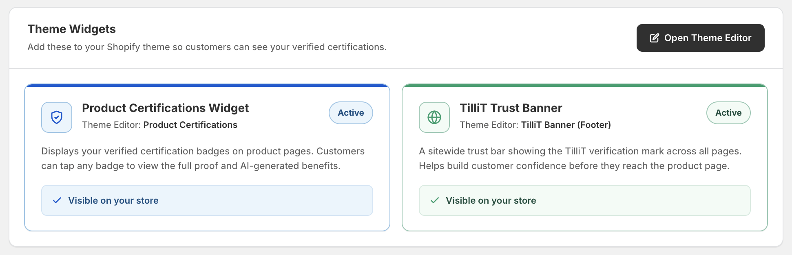

Click **Open Theme Editor** to manage widget placement.

**Setup Progress** shows how many widgets are active (e.g. 1 / 2 active).

#### Product Certifications Widget

- **Status:** Active
- **Theme Editor section:** Product Certifications
- Displays your verified certification badges directly on product pages
- Customers can tap any badge to view the full verification proof and AI-generated benefits

#### TilliT Trust Banner

- **Status:** Not Added by default
- **Theme Editor section:** TilliT Banner (Footer)
- A sitewide trust bar that shows the TilliT verification mark across all pages
- Helps build customer confidence before they even reach a product page

---

### Product Badge List

Below the Theme Widgets section, each product in your catalog is listed with its badge status.

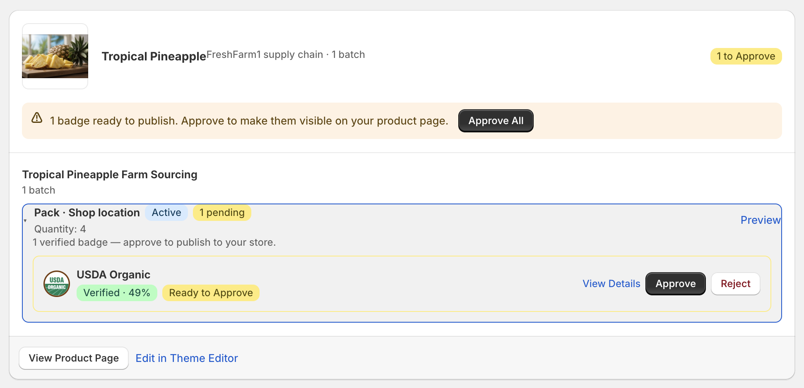

For each product you can see:

- Product name and supplier
- Number of supply chains and batches
- Active badge(s) with verification status

Each badge shows:

| Status                                                       | Meaning                                          |
| ------------------------------------------------------------ | ------------------------------------------------ |
| Live on Store    | Badge is approved and visible to customers       |
| Ready to Approve | Badge has been verified — awaiting your approval |
| Verified · X%     | Verification confidence score                    |

**Available actions per badge:**

- **View Details** — see the full verification proof
- **Revoke** — remove the badge from your storefront immediately
- **Preview** — preview how the badge looks on the product page
- **Set as Active** — activate a specific supply chain batch for display

**Per-product buttons:**

- **View Product Page** — open the live product page on your store
- **Edit in Theme Editor** — jump directly to the widget placement for that product

---

## Dashboard Metrics

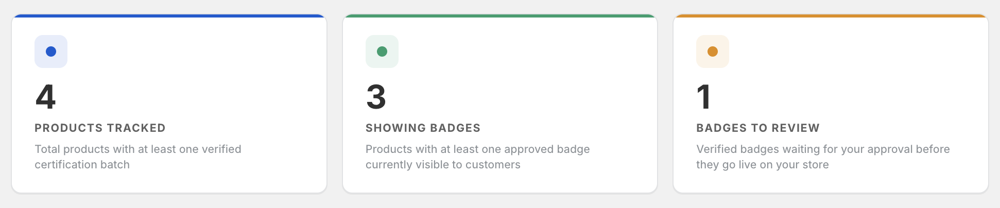

A quick summary of certification activity across your store:

| Metric               | Description                                                     |
| -------------------- | --------------------------------------------------------------- |
| **Products tracked** | Total products with at least one certification                  |
| **Showing badges**   | Products currently displaying approved badges on the storefront |
| **Badges to review** | Certifications pending your approval                            |

---

## Badge Approval Workflow

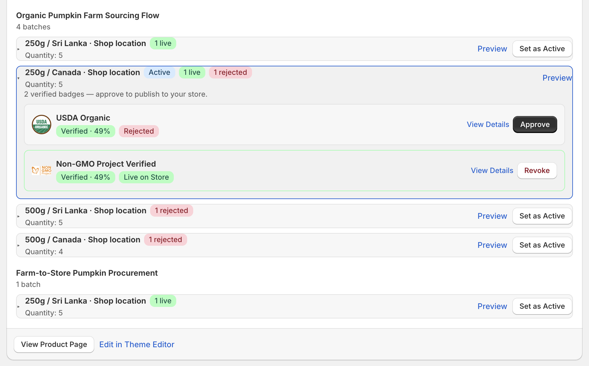

Badges go through multiple stages before becoming visible to customers:

| Status                                                       | Meaning                                            |
| ------------------------------------------------------------ | -------------------------------------------------- |
| Verified          | Badge authenticity has been confirmed by TilliT AI |
| Ready to Approve | Verified and awaiting your approval                |
| Live on Store    | Approved and visible to customers                  |
| Rejected           | Badge failed validation                            |

:::info
Only approved badges are visible on your storefront.
:::

---

## Certification Examples

Common certification badges supported by TilliT AI:

- **USDA Organic** — verifies compliance with USDA or international organic standards
- **Non-GMO Project Verified** — confirms ingredients are not genetically modified
- **Certified Gluten-Free** — proof of gluten levels below 20ppm
- **Fair Trade International** — validates ethical sourcing and fair labour practices

These certifications indicate compliance with recognised quality and sourcing standards.

---

## Supply Chain & Batch Details

Each product card includes traceable supply chain data:

- **Origin location** — e.g. Sri Lanka, Canada
- **Batch quantity** — number of units per batch
- **Certification per batch** — which badges apply to each batch

This ensures full transparency from sourcing to storefront.

---

## Search & Filters

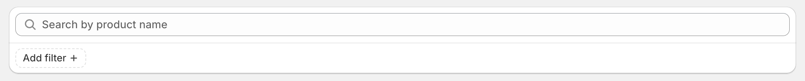

Use search and filtering to quickly locate products in the badge list:

1. Search by **product name**
2. Apply filters based on:
   - Badge status
   - Certification type

---

## Badge Verifications

The **Badge Verifications** tab shows a complete record of all badge verification activity across your products. It provides deeper insight into verification confidence, approval status, and batch-level certification details.

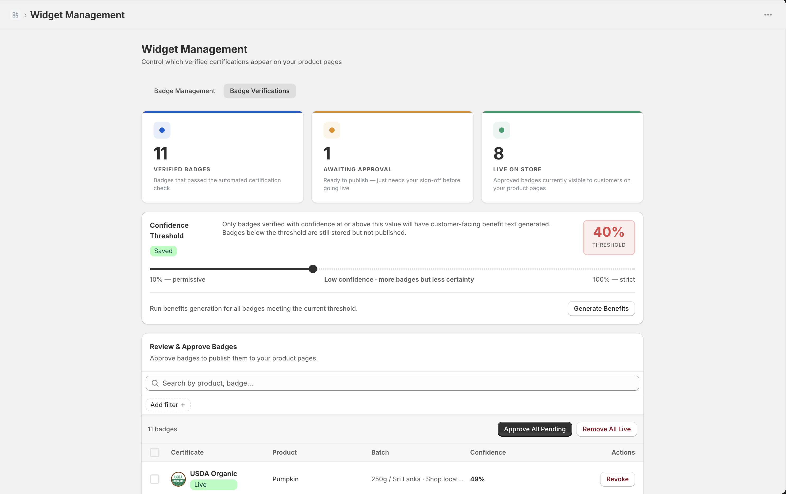

---

### Verification Summary

At the top of the page, you can see a quick summary of all badge activity:

| Metric                | Description                                            |
| --------------------- | ------------------------------------------------------ |
| **Verified badges**   | Total badges that passed automated verification checks |
| **Awaiting approval** | Badges ready to publish but require your approval      |
| **Live on store**     | Badges currently visible to customers                  |

This helps you quickly monitor the overall verification pipeline.

---

### Confidence Threshold

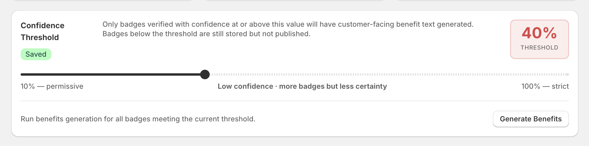

The **Confidence Threshold** controls which badges are eligible for customer-facing benefit generation.

- Current threshold defines the **minimum verification score**
- Only badges meeting this threshold will generate AI-based benefit descriptions

#### Behavior:

- **Below threshold**

  - Badge is stored in the system
  - Not published to customers

- **Above threshold**
  - Eligible for storefront display
  - Can include AI-generated benefits

#### Scale:

| Level                | Effect                                  |
| -------------------- | --------------------------------------- |
| **10% (Permissive)** | More badges included, lower certainty   |
| **100% (Strict)**    | Fewer badges included, higher certainty |

:::info
Adjust this value to balance between badge coverage and verification accuracy.
:::

---

### Benefits Generation

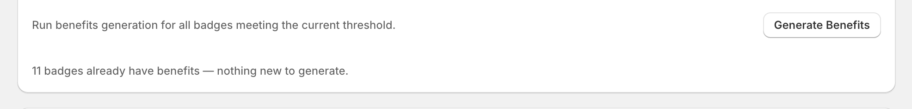

You can trigger AI-powered benefit generation for all badges that meet the current confidence threshold.

This feature:

- Explains the value of certifications to customers
- Improves trust and clarity on product pages
- Runs only on eligible badges

---

### Review & Approve Badges

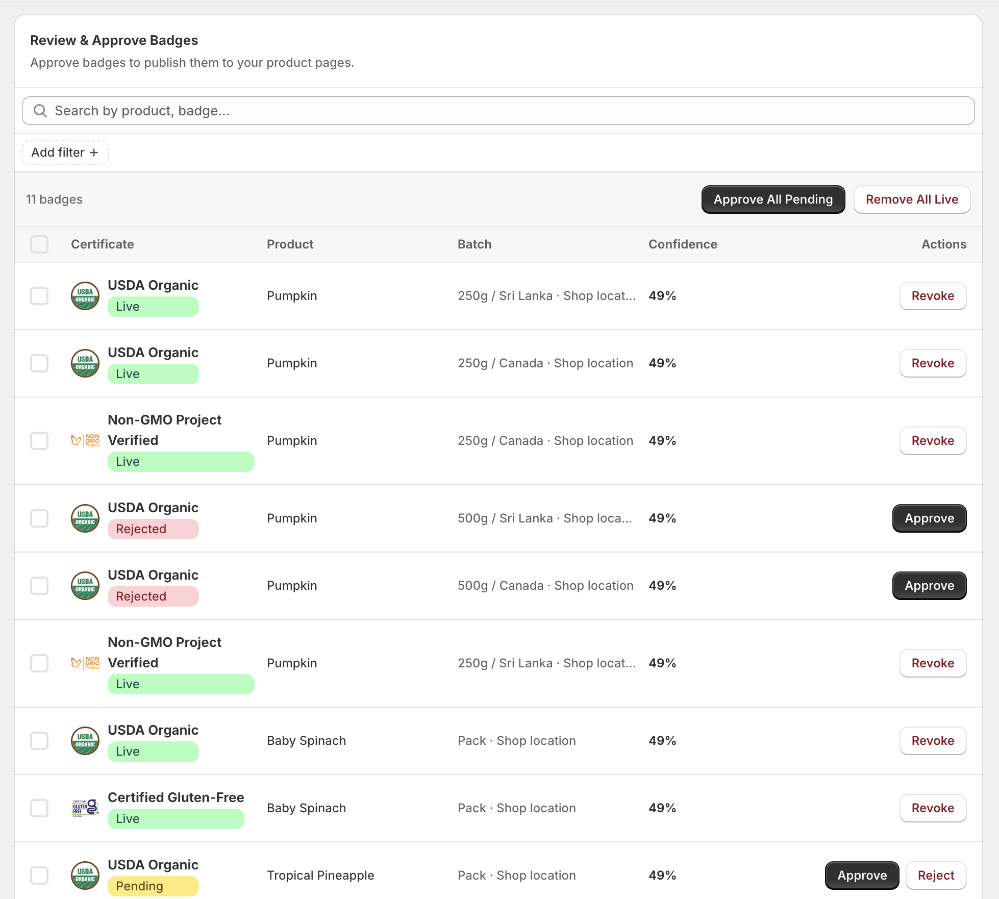

This table lists all verified badges across your products and allows you to manage their status.

#### Table Columns

| Column          | Description                                    |
| --------------- | ---------------------------------------------- |
| **Certificate** | Name of the certification (e.g., USDA Organic) |
| **Product**     | Associated product                             |
| **Batch**       | Specific product batch                         |
| **Confidence**  | Verification score                             |
| **Actions**     | Approval or rejection controls                 |

---

### Badge Status Types

Each badge has a status that determines its visibility:

| Status                                              | Meaning                                 |
| --------------------------------------------------- | --------------------------------------- |
| Live    | Approved and visible on your storefront |
| Pending | Awaiting manual approval                |
| Rejected  | Failed validation or manually rejected  |

:::warning
Only **Live** badges are visible to customers.
:::

---

### Approval Workflow

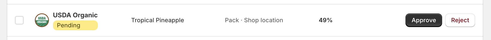

Badges follow a structured lifecycle:

1. **Verified** — badge passes automated checks
2. **Pending** — waiting for admin approval
3. **Approved (Live)** — visible on storefront
4. **Rejected** — removed from eligibility

This ensures full administrative control over what appears on your store.

---

### Batch-Level Verification

Badges are applied at the **batch level**, not just the product level.

This enables:

- Region-specific verification (e.g., Sri Lanka, Canada)
- Accurate certification tracking per batch
- Full supply chain transparency

---

### Search & Filtering

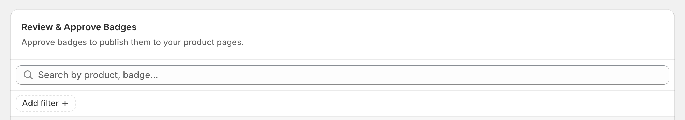

Use search and filters to quickly find specific badges:

- Search by **product name** or **certificate**
- Filter by:
  - Status (Live, Pending, Rejected)
  - Certification type

---

### Example: Multi-Batch Certification

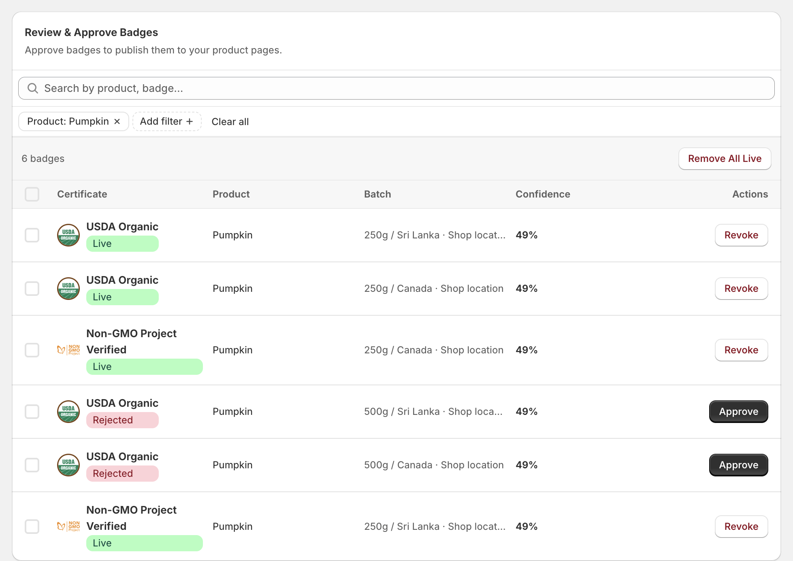

Example: A product may have multiple batches with different certification outcomes:

- Same certification across multiple regions
- Some batches **approved**, others **rejected**
- Different confidence scores per batch

This reflects real-world supply chain variation and ensures accurate certification visibility.

---

### Key Notes

- Badges must be approved before appearing on the storefront
- Confidence threshold affects benefit generation, not raw verification storage
- Verification is performed per batch, not just per product
- Only approved badges are visible to customers

---

<PageFeedback />
