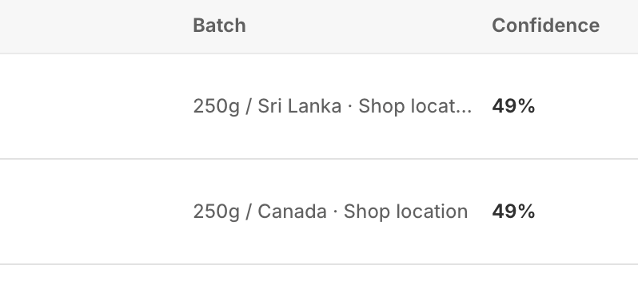

# In Progress...
# Product Certification Badge Management System

This dashboard allows store owners to manage **verified certification badges** for products. These badges represent trusted verifications (e.g., Organic, Non-GMO) and are only displayed to customers after approval.

---

## Overview

The **Widget Management** dashboard provides full control over:
- Badge approvals
- Storefront visibility
- Product-level certification tracking

:::warning
> No badge appears on the storefront until it is approved.
:::

---

## Badge Management

This section controls how certification badges are approved before being displayed.

### Approval Modes

- **Manual Approval**
  - Each badge must be reviewed and approved manually
- **Auto-Approve**
  - Badges are automatically published without review
- **Require Approval**
  - Ensures all badges go through validation before going live

### Status Indicator
- Displays the number of badges **awaiting approval**

---

## Theme Widgets

Widgets control how badges are displayed on your storefront.

### Product Certifications Widget
- Displays badges on product pages
- Customers can click badges to view:
  - Verification proof  
  - AI-generated benefits  

### TilliT Trust Banner
- A sitewide trust indicator
- Visible across all pages
- Helps build customer confidence before product interaction

---

## Dashboard Metrics

Quick summary of certification activity:

- **Products tracked**  
  Total products with at least one certification  

- **Showing badges**  
  Products currently displaying approved badges  

- **Badges to review**  
  Certifications pending approval  

---

## Product-Level Management

Each product includes detailed certification data:

- Product name and supplier  
- Supply chain information  
- Batch tracking  
- Badge status  

---

## Badge Approval Workflow

Badges go through multiple stages before becoming visible:

### Status Types

- **Verified**  
  Badge authenticity has been confirmed  

- **Ready to Approve**  
  Awaiting admin approval  

- **Live on Store**  
  Visible to customers  

- **Rejected**  
  Badge failed validation  

:::info
> Only approved badges are visible on the storefront.
:::

---

## Certification Examples

{/*  */}

Common certification badges include:

- USDA Organic  
- Non-GMO Project Verified  
- Certified Gluten-Free  
- Fair Trade International  

These indicate compliance with recognized quality and sourcing standards.

---

## Supply Chain & Batch Details

{/*  */}

Each product includes traceable supply chain data:

- Origin location (e.g., Sri Lanka, Canada)  
- Batch quantity  
- Certification per batch  

This ensures full transparency from sourcing to store.

---

## Search & Filters

Use search and filtering to quickly locate products:

- Search by product name  
- Apply filters based on:
  - Badge status  
  - Certification type  

---
